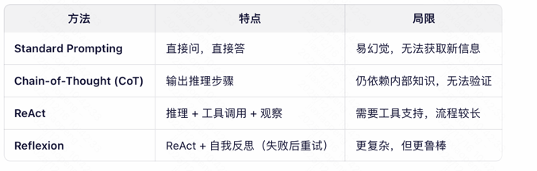

# ReAct框架
ReAct（Reasoning + Acting）框架 是一种结合 推理（Reasoning） 与 行动（Acting） 的提示（prompting）和智能体（Agent）设计范式，
由 Google Research 和 Princeton University 在 2022 年提出（论文：ReAct: Synergizing Reasoning and Acting in Language Models）。
它的核心思想是：让大语言模型（LLM）在解决问题时，交替进行“思考”和“行动”，从而更可靠、可解释、可交互地完成复杂任务。
ReAct 模拟这一过程，让 LLM：
Reason（推理）：生成自然语言的“思维链”（Chain-of-Thought），分析当前状态、目标、下一步计划。
Act（行动）：调用外部工具（如搜索、数据库、API、计算器等）获取真实世界信息。
Observe（观察）：接收工具返回的结果，作为新上下文继续推理。
这个过程循环进行，直到任务完成。
ReAct = Think + Do + See → Repeat
# ReAct 的典型格式（Prompt Template）]
Question: {问题}

Thought: 我需要先了解...
Action: Search["关键词"]
Observation: {搜索结果}

Thought: 根据结果，我可以推断...
Action: Calculator["2023 - 1990"]
Observation: 33

Thought: 现在我知道答案了。
Action: Finish["答案是 33 岁"]

现代 LLM Agent 框架（如 LangChain、LlamaIndex、AutoGen、OpenDevin）普遍采用 ReAct 或其变种.

# ReAct vs 其他范式

方法	特点	局限
Standard Prompting	直接问，直接答	易幻觉，无法获取新信息
Chain-of-Thought (CoT)	输出推理步骤	仍依赖内部知识，无法验证
ReAct	推理 + 工具调用 + 观察	需要工具支持，流程较长
Reflexion	ReAct + 自我反思（失败后重试）	更复杂，但更鲁棒

# ReAct
